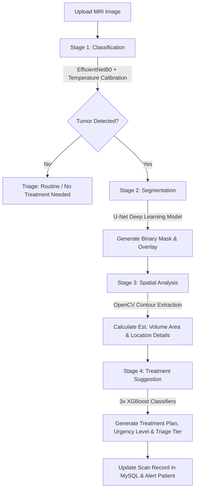

# 🏥 OncoSight — Advanced AI-Powered Brain Tumor Detection & Clinical Portal

OncoSight is a premium, state-of-the-art clinical platform integrating a **4-stage machine learning pipeline** with a comprehensive user-facing clinical portal. The platform empowers patients to upload MRI scans for instant diagnostic analysis, connects them with verified specialists, and provides neurosurgeons, radiologists, and admins with a unified workspace to manage patient care, clinical reviews, and database records.

---

## 📸 System Architecture & Visualizations

To help visualize the system structure on GitHub, the repository includes full diagrams detailing the architecture, components, and deployments:

### 1. Three-Tier System Architecture
The platform is organized into three clean layers: a responsive frontend Client, a secure Node.js Express API Gateway, and a dedicated high-performance Python FastAPI Inference service.


### 2. Component Architecture
Detailed visualization of internal components, context providers, controllers, database models, and stage-by-stage pipelines:


### 3. Deployment Architecture
How the Docker containers, Node runtime, FastAPI server, and MySQL database bind together in deployment:


### 4. Patient Use Case Flow
Comprehensive UML mapping of patient interactions, scan history, intake, and doctor consultations:


---

## 🧠 Core AI Pipeline (4-Stage Architecture)

All scans uploaded to the platform run through a multi-model pipeline developed in Python and wrapped in FastAPI:



1. **Stage 1: Classification** (EfficientNetB0 + Temperature Calibration) — Classifies scans into four classes: `glioma`, `meningioma`, `pituitary`, or `notumor`. High/low confidence is calibrated using temperature scaling.
2. **Stage 2: Segmentation** (U-Net) — Segmentor calculates pixel-level tumor masks to pinpoint exact boundaries.
3. **Stage 3: Spatial Analysis** (OpenCV) — OpenCV contour logic measures estimated volume area (in mm²), identifies tumor hemisphere (left, right, midline), and extracts specific lobe locations (Frontal, Parietal, Temporal, Occipital, Sellar).
4. **Stage 4: Treatment Suggestion** (3x XGBoost) — An ensemble of XGBoost models merges patient demographics and clinical history with image metrics to output a suggested treatment plan, urgency level, and triage tier.

---

## ⚡ Key Features

*   **Charcoal Futuristic UI**: Sleek, glassmorphic dark interface optimized for clinical portals.
*   **Bilingual Translation**: Complete localization in **English** and **Arabic** (RTL support).
*   **Intake Wizard**: One-time clinical intake setup that auto-fills details and acts as a safety guard before uploading scans.
*   **Dynamic Tumor Highlights**: Renders real U-Net segmentation mask overlays dynamically rather than hardcoding static mock elements.
*   **Persistent Floating Chat**: Secure end-to-end chat panel between patients and doctors available across all pages.
*   **Unified Admin Dashboard**: Verification system for registering doctors, platform-wide stats, scan database editors, and user account management.
*   **Clinical Review & Overrides**: Doctors can review patient MRI scans, view clinical histories, accept/decline queue items, write notes, and override AI recommendations.

---

## 🛠️ Technology Stack

| Component | Technology | Details |
| :--- | :--- | :--- |
| **Frontend** | React, Vite, React Router, Vanilla CSS | Glassmorphism design system, Space Grotesk typography |
| **Database** | MySQL | Relational schema with full foreign keys |
| **Backend API** | Express.js, Node.js, JWT, Zod | Token-based sessions (Access & Refresh), Zod schema validations |
| **AI Service** | FastAPI, Python 3.10 | TensorFlow/Keras, Scikit-learn, OpenCV, XGBoost |

---

## 🚀 Getting Started

### Prerequisites
- Node.js (v18+)
- Python (v3.10+)
- MySQL Database

### Installation

1. **Clone the repository**:
   ```bash
   git clone https://github.com/elgazar04/GraduationProjectWebsite.git
   cd GraduationProjectWebsite
   ```

2. **Database Setup**:
   Create a database named `brainscan` in MySQL and import the schema:
   ```bash
   mysql -u root -p brainscan < backend/schema.sql
   ```

3. **Install Frontend Dependencies**:
   ```bash
   npm install
   ```

4. **Install Backend Dependencies**:
   ```bash
   cd backend
   npm install
   ```
   Create a `backend/.env` file:
   ```env
   PORT=5000
   DB_HOST=localhost
   DB_USER=root
   DB_PASSWORD=your_password
   DB_NAME=brainscan
   JWT_SECRET=your_jwt_secret
   JWT_REFRESH_SECRET=your_refresh_secret
   ```

5. **Install AI Service Dependencies**:
   ```bash
   cd ai-service
   python -m venv venv
   # Windows:
   venv\Scripts\activate
   # Linux/macOS:
   source venv/bin/activate
   pip install -r requirements.txt
   ```

### Running the Project

You can run the entire stack (AI FastAPI Service, Express Backend API, and Vite Frontend UI) concurrently using the root npm runner:
```bash
npm start
```

*   **Frontend Client**: `http://localhost:5173`
*   **Backend API Gateway**: `http://localhost:5000`
*   **FastAPI AI Docs**: `http://localhost:8000/docs`

---

## 📋 Complete Route Reference

For a complete breakdown of all Express API controllers and React Router paths, refer to the [Complete Route Reference Guide](ROUTES.md).
